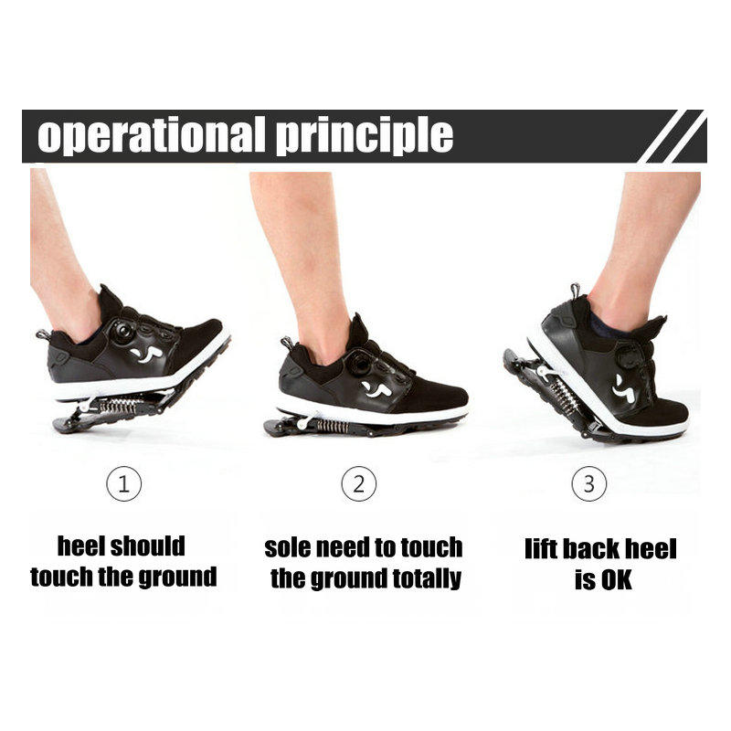

# Introduction

Mechanical running shoes contain a spring and an electromagnetic assistance system. With every step, the assistant creates a magnetic field that tightens the spring attached to the bottom of the shoes. When the shoes touch the ground, the assistant releases the spring, which bounces off the ground and propels the foot up.

The goal of this design is to increase walking or running speed at the cost of a slight decrease in balance. With each step, the spring's release creates a small jump.

The shoe's microcontroller has a "break-in" mode that slowly increases the assistance provided. The spring itself is hard and doesn't provide much bounce on its own.

The shoe allows for two types of customization. The first is electronic limiting of the assistance, while the second is via tightening screws or a set of screws.

The bouncing spring can also be hydraulic, making this shoe the reverse of power harvesting footwear.

The microcontroller relies on an accelerometer, altimeter, pressure sensors, etc. to register movement and speed in multiple dimensions, depending on its capability. This allows it to measure impact and weight distribution, adapting the timing and power of the provided assistance on every step.

More applications

*  Auto-Accommodating Therapeutic Brace
*  Gait therapy applications
*  

# Todo

* Consider the weight and size of the shoes: While the added components of the mechanical spring and electromagnetic assistance system may increase the functionality of the shoes, they may also make them heavier and bulkier. Finding ways to reduce the weight and size of the shoes could improve their overall performance and comfort.

* Focus on balance and stability: While the goal of the design is to increase walking or running speed, it's important to ensure that the shoes maintain a good level of balance and stability to prevent falls or injuries. Consider ways to improve the shoes' stability, such as using different materials or adjusting the spring tension.

* Improve customization options: The design currently allows for two types of customization - electronic limiting of the assistance and tightening screws. Expanding on these options or adding additional customization options could give users more control over the shoes' functionality and comfort. One idea is to make the dynamic sole removable.

* Increase compatibility with different foot sizes and shapes: To ensure that the shoes can be worn comfortably by a wider range of users, consider ways to increase their compatibility with different foot sizes and shapes. This could include using more flexible materials or offering different sizes and shapes of the mechanical components.

* Incorporate energy recovery technology: Since the shoes already incorporate an electromagnetic assistance system, adding energy recovery technology could potentially make them more efficient and eco-friendly. This could include using regenerative braking to recover energy during deceleration or incorporating solar panels to provide additional power to the shoes.

# Links 

* [Power harvesting footwear](https://www.frontiersin.org/articles/10.3389/fmats.2019.00221/full)
* https://www.aliexpress.com/item/1005002499268270.html
* Motorized walking shoes 
* Pacewing Industry Co., Ltd
* Bionic Boots
